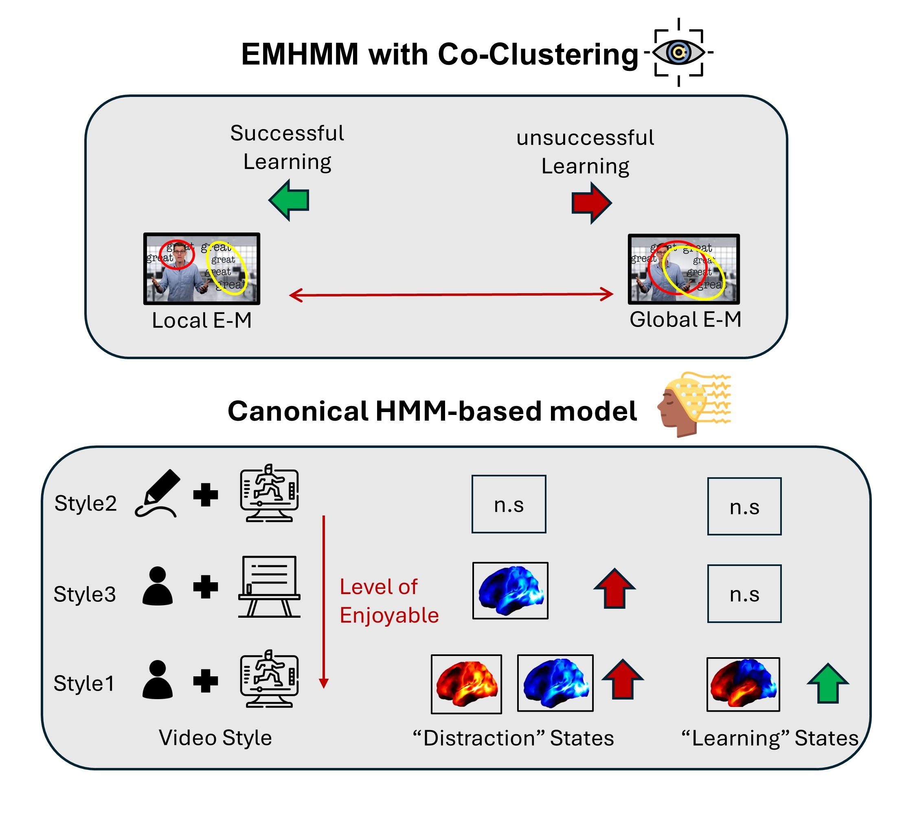
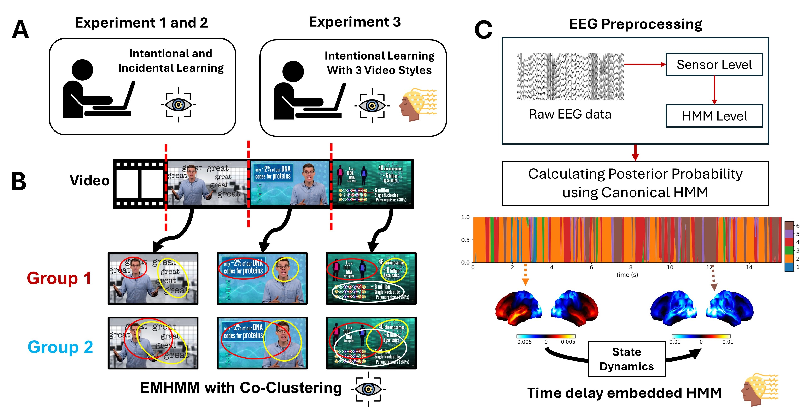

# Emotion influences behavioral outcomes and attention during goal-directed reading
___

 
___
## **Abstract**
Online education has become a prominent feature of modern learning. However, what determines learning success in online education remains unclear. To explore this, the present study applies Hidden Markov Model to eye-tracking and EEG data in an open datasets contains education video viewing task. The model revealed two eye movement patterns: a global pattern where fixations distributed across the video, and a local pattern where fixations focuses on video-relevant features. The model also revealed 6 distinct brain states involving attention and memory. Experiment 1 and 2 explore the impact of task engagmenet on eye movement. We found that compared to intentional learning condition, more participants uses global pattern and suffers from worse memory performance in incidental learning condition. Experiment 3 explore the impact of video style. We found that only in the person with animation style, the local eye movement pattern and memory brain states are associated with learning success. In all, this study explore factors that indictate success and offer insights for improving learning efficiency in online education.
___
## **Introduction**

 

In short, our analysis includes 2 parts:

* EMHMM modelling with co-clustering on Eye fixations (see [**This paper**](https://link.springer.com/article/10.3758/s13428-021-01541-5) for more detail)
* Using Canonical-HMM to calculate posterior probability on EEG data  (see [**This preprint**](https://www.biorxiv.org/content/10.1101/2025.10.21.683692v1) for more detail)

In simple term, we segment the video following the principle that keeps features within the segments as consistent as possible (Shown as Figure above), and apply EMHMM methods. After processing EEG into source reconstructed space, when apply canonical-HMM which are pretrained on a large datasets on our data to discover fast brain transitions.

The github repo is organized in three experiments, Experiment 1 and 2 contains only Eye tracking analysis. Experiment 3 contains both Eye tracking and EEG analysis.

___
## **Datasets**

Please see [**Brain, Body, and Behaviour Dataset**](https://bbbd.pythonanywhere.com/) for more detail. 

___
## **Contact**

Due to double blind review process, we decided to anonymise this. Contact will be released once formal acceptance.